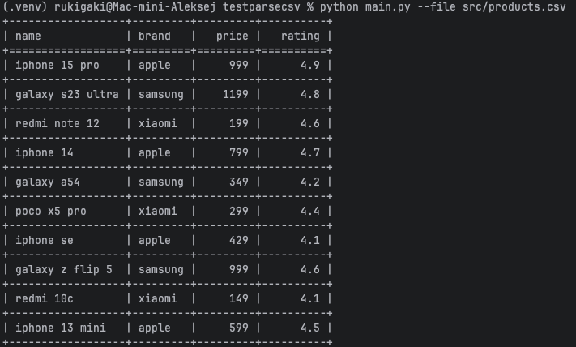
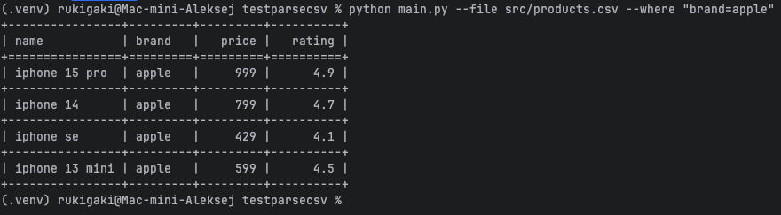
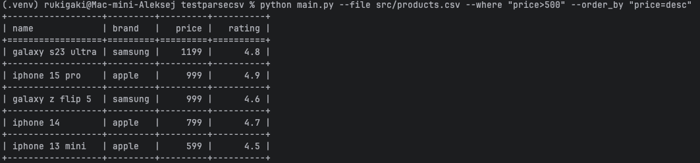
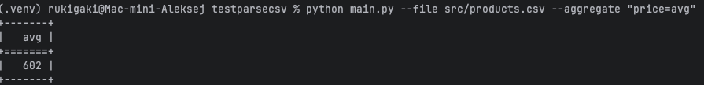
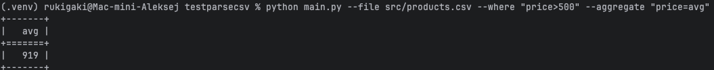
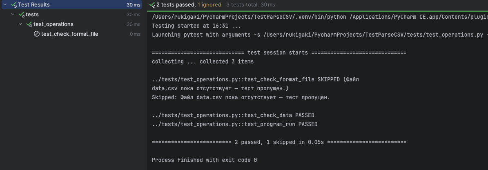

# Обработка CSV файла
___
## Описание

Этот проект позволяет обрабатывать CSV-файлы, 
применять фильтры, агрегировать данные и сортировать результаты.

___
#### Команда вывода таблицы

___
#### Команда where

___
#### Команда where + order_by

___
#### Команда aggregate

___
#### Команда aggregate на отфильтрованной таблице

___
#### Тесты

